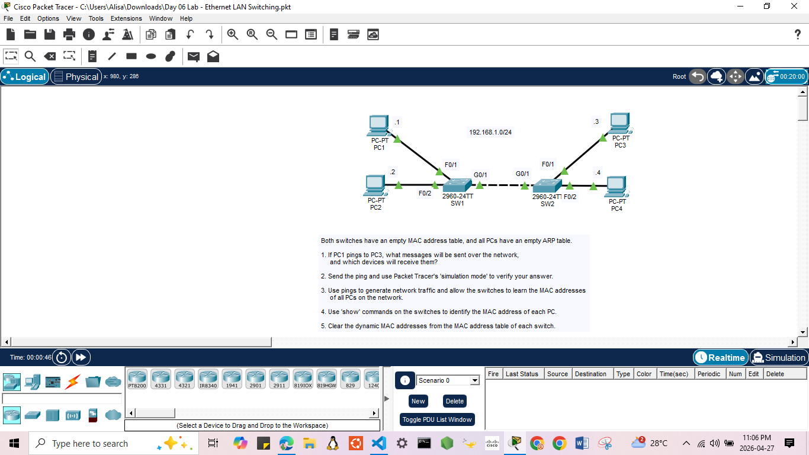
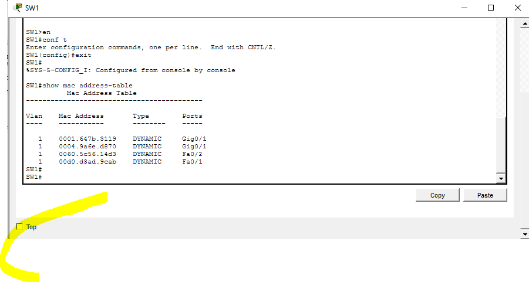
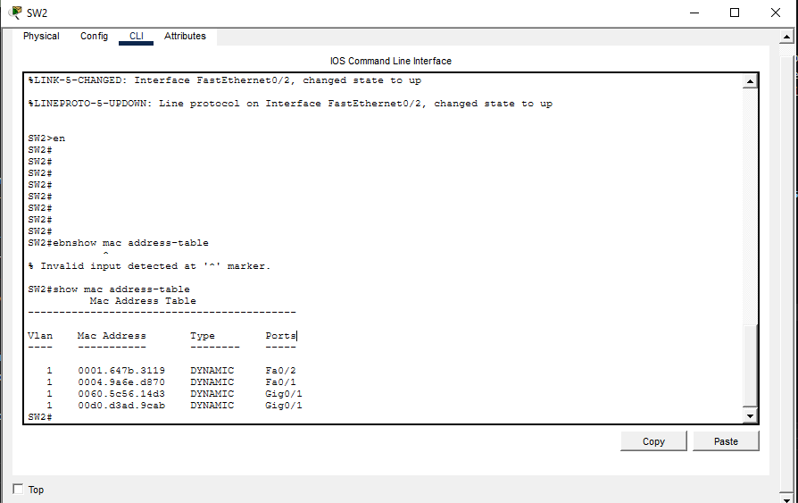

## 

# Both switches have an empty MAC address table, and all PCs have an empty ARP table.

## 1. If PC1 pings to PC3, what messages will be sent over the network, and which devices will receive them?
- PC1 needs to know PC3 MAC address first.
- PC1 will send an ARP Request message to PC2, PC3 and PC4.
- ARP Request is a broadcast message, so all devices on this LAN will receive it, except for PC1.
- PC2 and PC4 will drop or ignore the mesage but PC3 will receive the message and send an ARp Reply message.
- ARP Reply is a known unicast message and will be sent through SW2 and SW1 and PC1 will receive the message.
- PC1 will put MAC address of PC3 in its ARP table and and the MAC address will be used to ping PC3.
- PC1 send a ICMP Echo Request message and received by PC3.
- PC3 will receive the ICMP Echo Request and sends back ICMP Echo Reply to PC1.

## 2. Send the ping and use Packet Tracer's 'simulation mode' to verify your answer.
- On PC1, I clicked on Command Prompt.
- I used command 'ping 192.168.1.3' to ping PC3.

## 3. Use pings to generate network traffic and allow the switches to learn the MAC addresses of all PCs on the network.
- On PC2, I clicked on Command Prompt.
- I used command 'ping 192.168.1.4' to ping PC4.

## 4. Use 'show' commands on the switches to identify the MAC address of each PC.
- I clicked on SW1 and SW2 and clicked the CLI to interact with the switches.
- I used command 'show mac address-table' and the MAC addresses for PC1, PC2, PC3 and PC4 can be known.
- However in SW1, only PC! and PC2 can be identify. 
- In SW2, PC3 and PC4 can be identify.

- SW1

- SW2 

## 5. Clear the dynamic MAC addresses from the MAC address table of each switch.
- On both swithes, on their CLIs, I used command 'clear mac address-table dynamic'
- I used 'show mac address-table' to make sure the MAC address table is cleared.