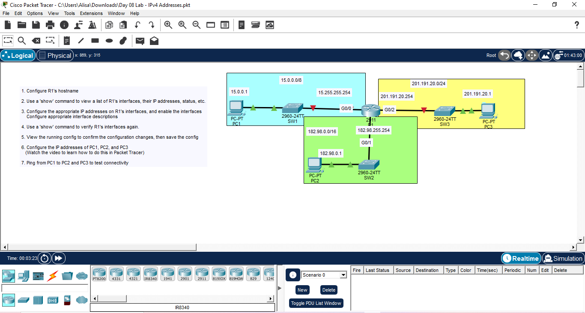
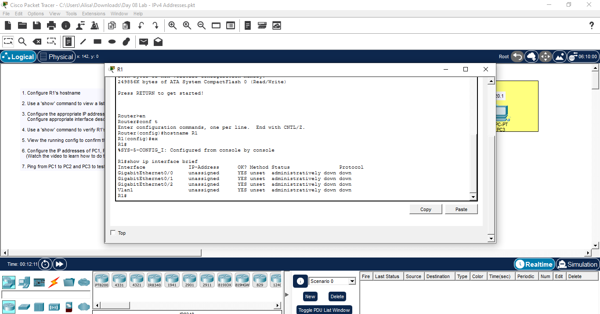
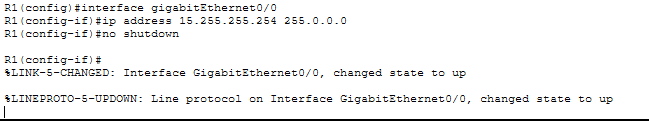
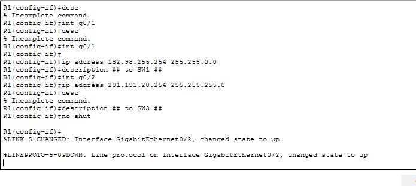
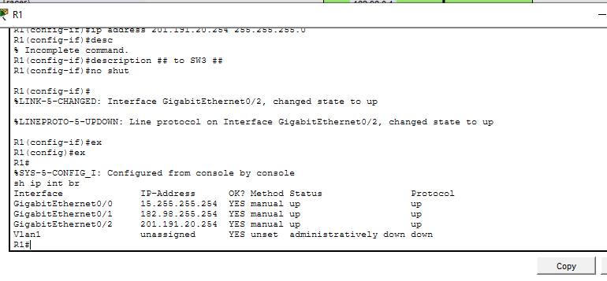
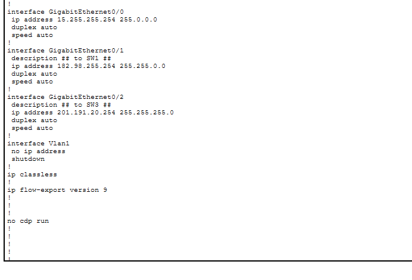
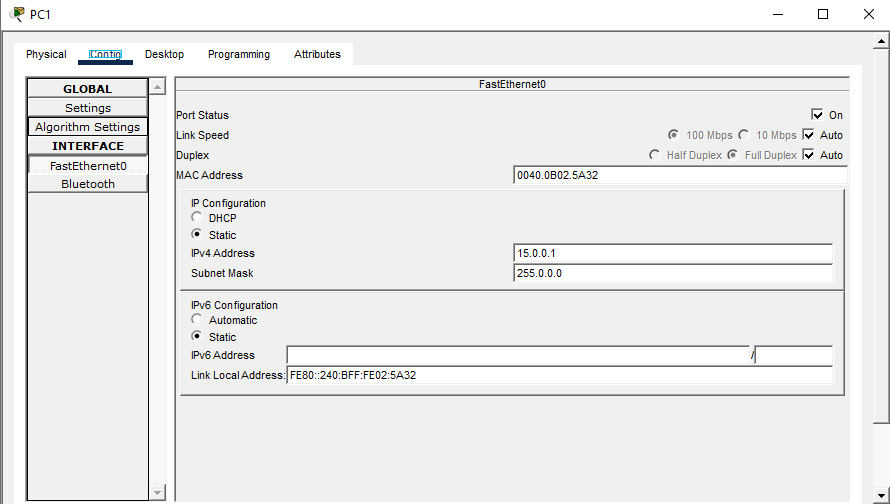
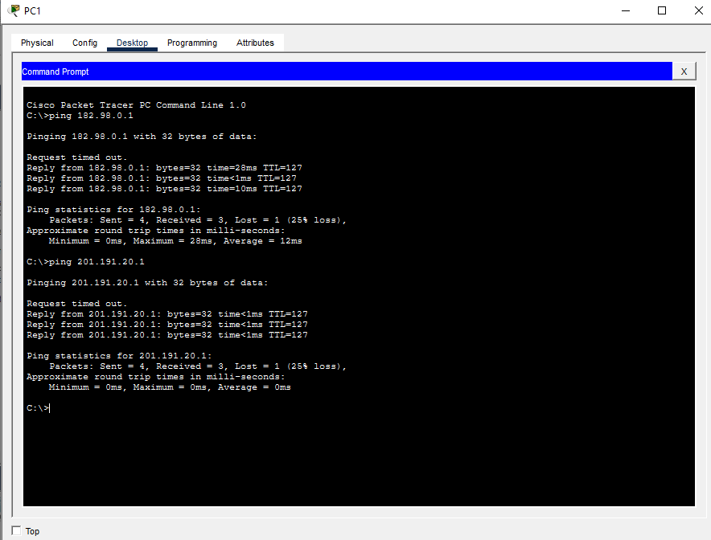

##

##1. Configure R1's hostname
- I haven't configured R!
- I clicked on R1
- I navigated to CLI tab
- In the command line, I used en command to enter privilege exec mode
- In order to configure the R1's hostname, we must navigate to global configuration mode, so conf t command is used.
- I have succcessfully entered global conf mode
- I entered 'hostname R1'
- The router name has been successfully changed to R1 (see the Router changed to R1 in the left side of the command line) 

##2. Use a 'show' command to view a list of R1's interfaces, their IP addresses, status, etc.
- i exited global conf mode and came back to privilge exec mode
- I entered 'show ip interfaces brief; command to view the list of R1's interfaces, their IP addresses, status, protocol, method.

##3. Configure the appropriate IP addresses on R1's interfaces, and enable the interfaces
     Configure appropriate interface descriptions
- I entered global conf mode
- I used 'interface gigabitEthernet0/0' command
- i entered 'ip address 15.255.255.254 255.0.0.0'
- i used 'description ## to SW1 ##' command to describe the ip address
- I disable the default shutdown by 'no shutdown'

##4. Use a 'show' command to verify R1's interfaces again.

##5. View the running config to confirm the configuration changes, then save the config
- I used 'show run'

##6. Configure the IP addresses of PC1, PC2, and PC3
   (Watch the video to learn how to do this in Packet Tracer)
- I clicked on PC1 -> Config tab -> FastEthernet0/0
- I put in 15.0.0.1 in the IPv4 Address
- 
- The steps are repeated with PC2 and PC3

##7. Ping from PC1 to PC2 and PC3 to test connectivity
- On PC1, on Command Prompt, I used 'ping' to ping PC2 and PC3
