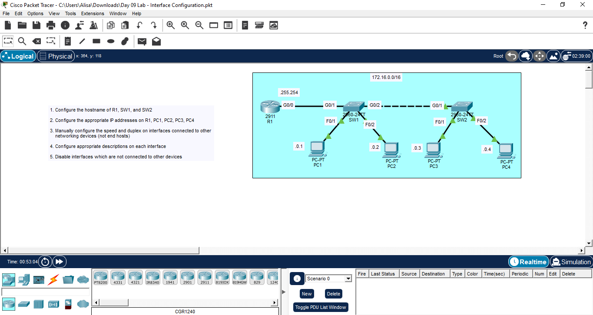

## 1. Configure the hostname of R1, SW1, and SW2
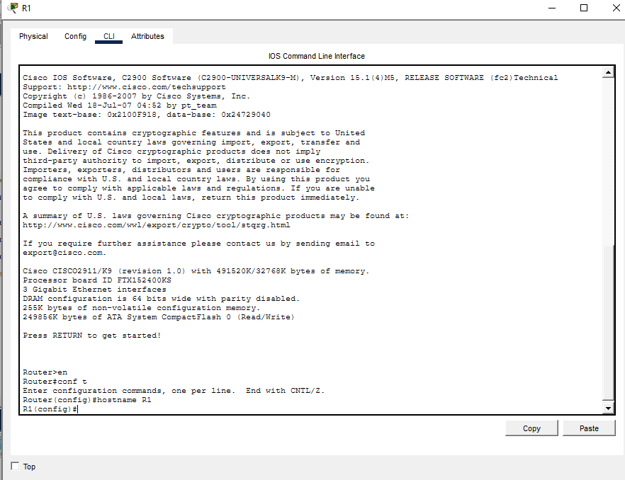
- I clicked on R1
- I navigated to CLI tab
- In the command line, I used en command to enter privilege exec mode
- In order to configure the R1's hostname, we must navigate to global configuration mode, so conf t command is used.
- I have succcessfully entered global conf mode
- I entered 'hostname R1'
- The router name has been successfully changed to R1 (see the Router changed to R1 in the left side of the command line) 
- The steps were repeated with SW1 and SW2

## 2. Configure the appropriate IP addresses on R1, PC1, PC2, PC3, PC4
PC1, PC2, PC3 and PC4
- I clicked on PC1 -> Config tab -> FastEthernet0/0
- I put in 172.16.0.1 in the IPv4 Address
- 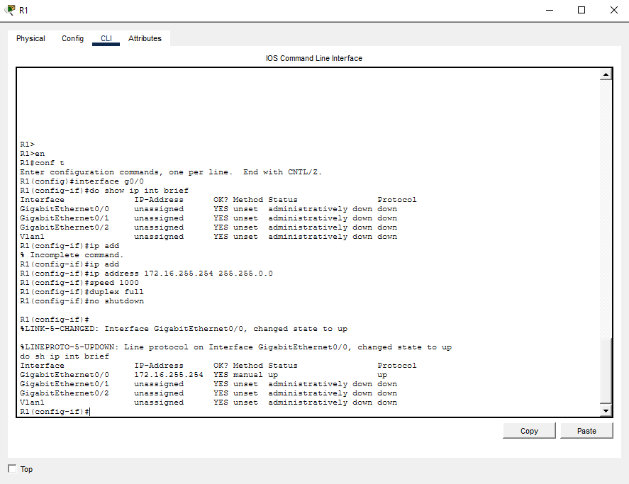
- The steps are repeated with PC2, PC2, PC3 and PC4 with IP addressess 172.16.0.2, 172.16.0.3 and 172.16.0.4 respectively.

## 3. Manually configure the speed and duplex on interfaces connected to other networking devices (not end hosts)
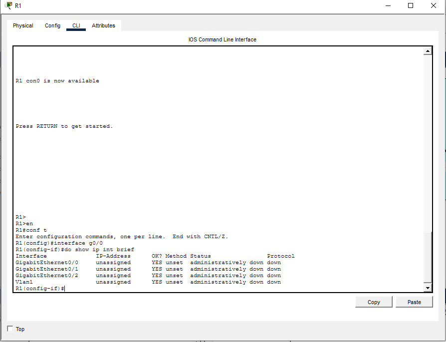
- global config mode > 'do show ip int brief'
- 'int g0/0'
- R1(config-if)>#ip addresses 172.16.255.254 255.255.0.0
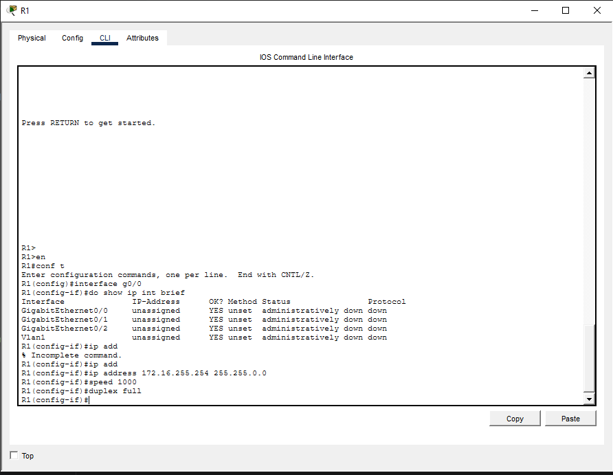
- speed 1000
- duplex full
- description ## to SW1 ##

- I manually described the g0/1 to g0/2 is not in use by using 'interface range g0/1 - 2' and 'description ## not in use ##' and to view it 'do show run'
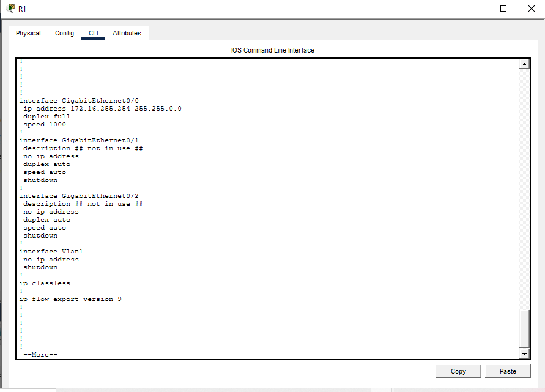
- I saved the configuration by exiting to the privilege exec mode and use 'copy running-config startup-config' and i hit enter and to view it again i used 'show startup-config'
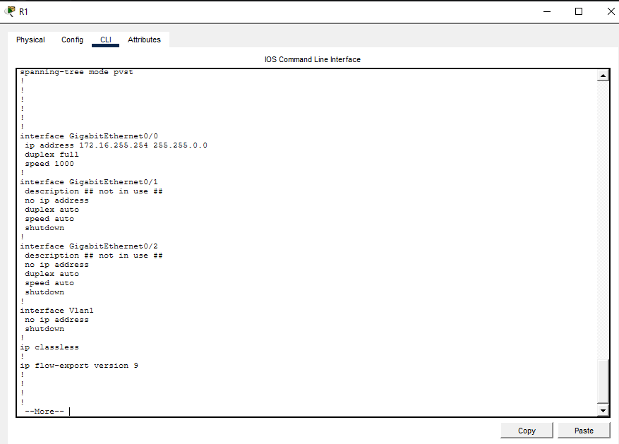

## 4. Configure appropriate descriptions on each interface

SW1 & 
- global config mode > 'do show int status' (command that only works on swithes and not routers)
- 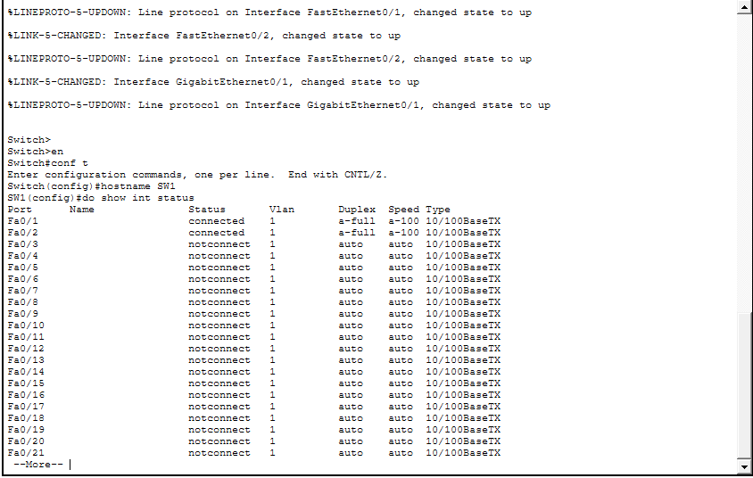
- interface g0/1
- speed 1000
- duplex full
- interface g0/2
- speed 1000
- duplex full
- to save 'write memory'
- to view 'show startup-config'

SW2
- global config mode > 'do show int status' (command that only works on swithes and not routers)
- 
- interface g0/1
- speed 1000
- duplex full
- 'int range f0/1 - 2' > description ## to end hosts ##
- 'shutdown'
- 'int range g0/2, f0/1 - 2' > description ## not in use ##
- 'shutdown'
- 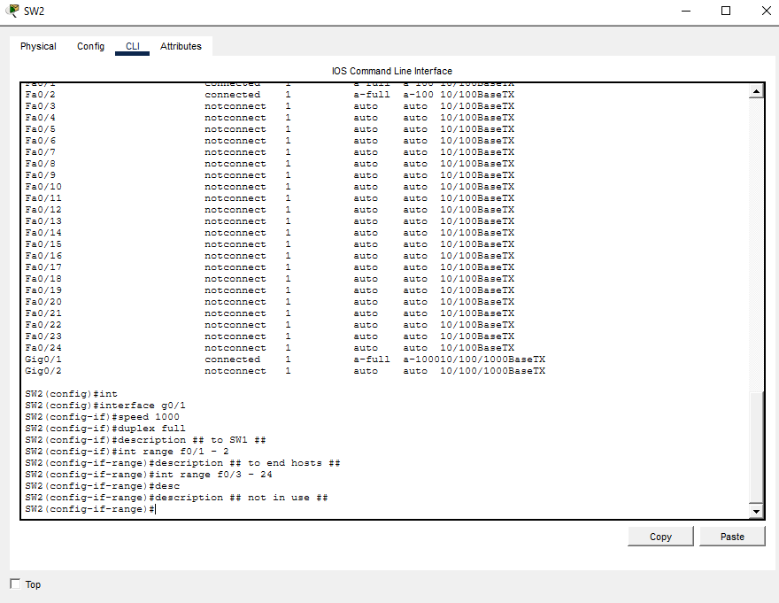
- 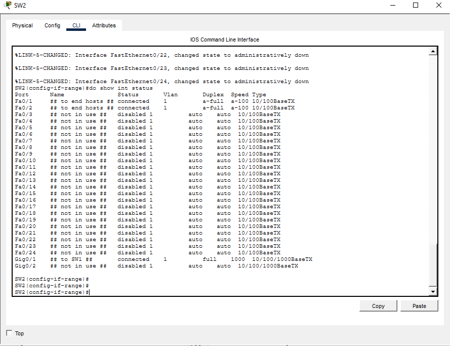
- to save 'write memory'
- to view 'show startup-config'
- 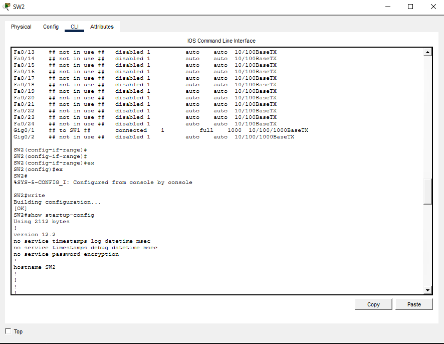

## 5. Disable interfaces which are not connected to other devices
- I used command
 - 'int range f0/3 - 24'
 - I typed 'description ## not in use'
 - I typed 'shutdown' 

## 6. Save the configurations
- privilege exec mode > write
- press enter
- 'show startup-config'