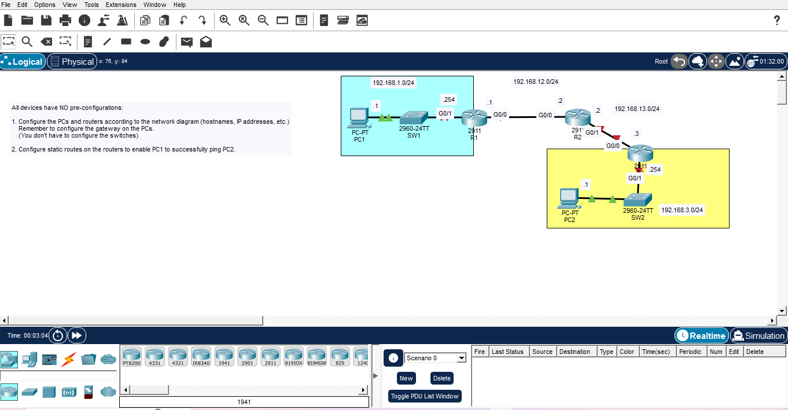

All devices have NO pre-configurations:

1. Configure the PCs and routers according to the network diagram (hostnames, IP addresses, etc.). Remember to configure the gateway on the PCs. (You don't have to configure the switches)
    - Firstly, I clicked on PC1 to configure the IP addresses of PC1 and its default gateway.
        - Config tab -> Default gateway: 192.168.1.254 (which is the R1's IP add.)
        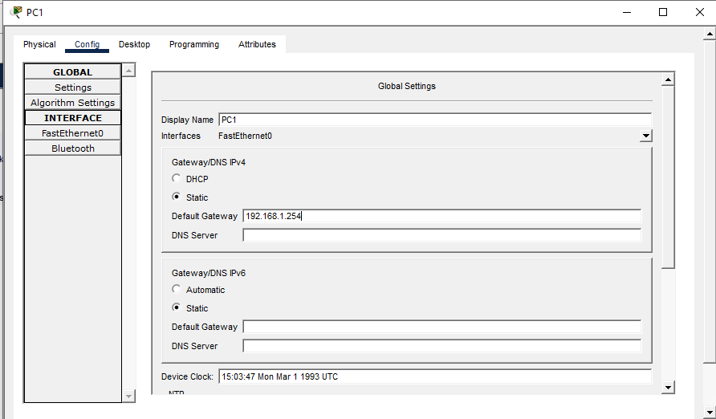
        - FastEthernet0 -> PC1 IP address: 192.168.1.1
        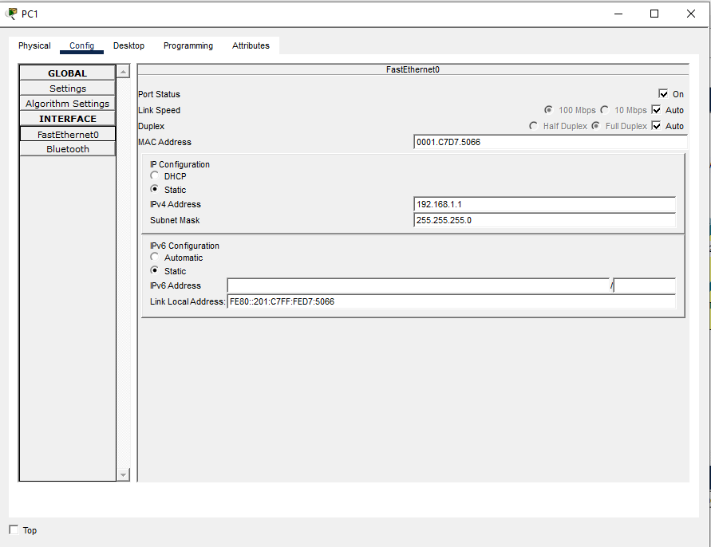
    - Secondly, I clicked on R1
        - CLI tab -> en (stands for enable) -> conf t (enters global conf mode) -> hostname R1
        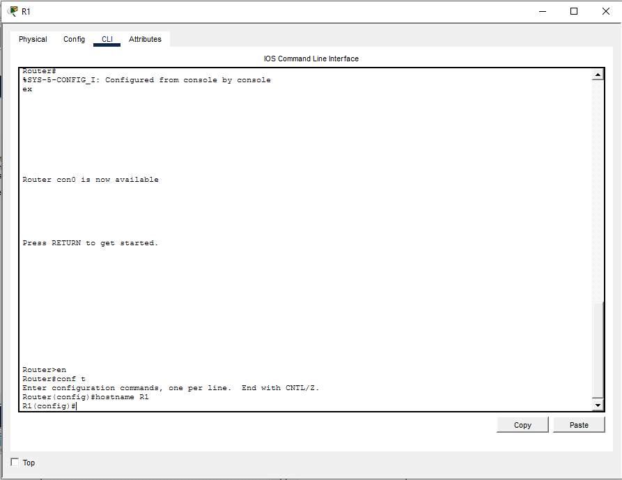
        - Still in global conf mode -> interface g0/1 -> R1 (config-if)#ip adddress 192.168.1.254 255.255.255.0 -> description ## to SW1 ##
        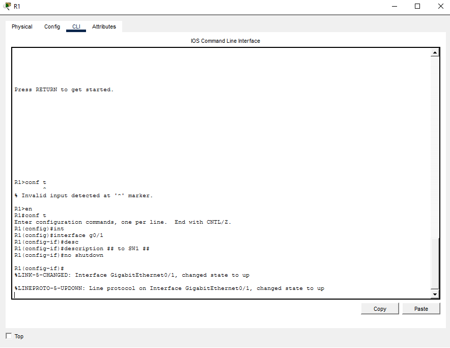
        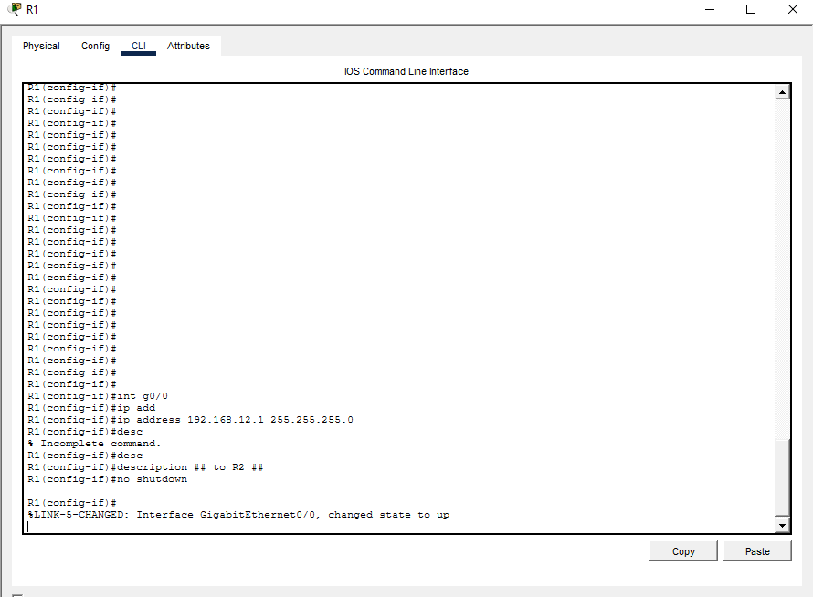
        - do show ip int brief
        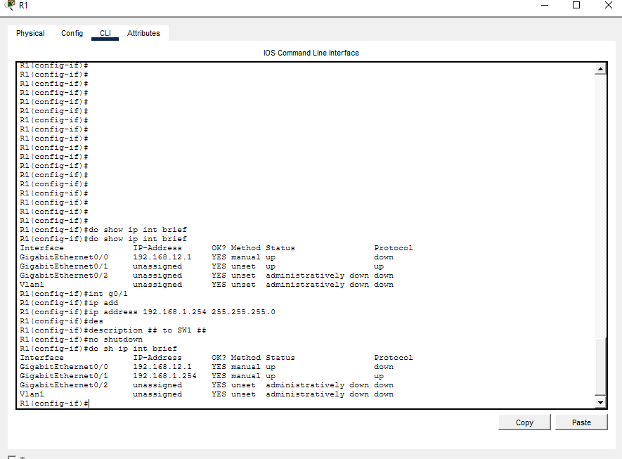
    - Thirdly, I configured R2 similar to R1 but different interfaces and IP addresses
        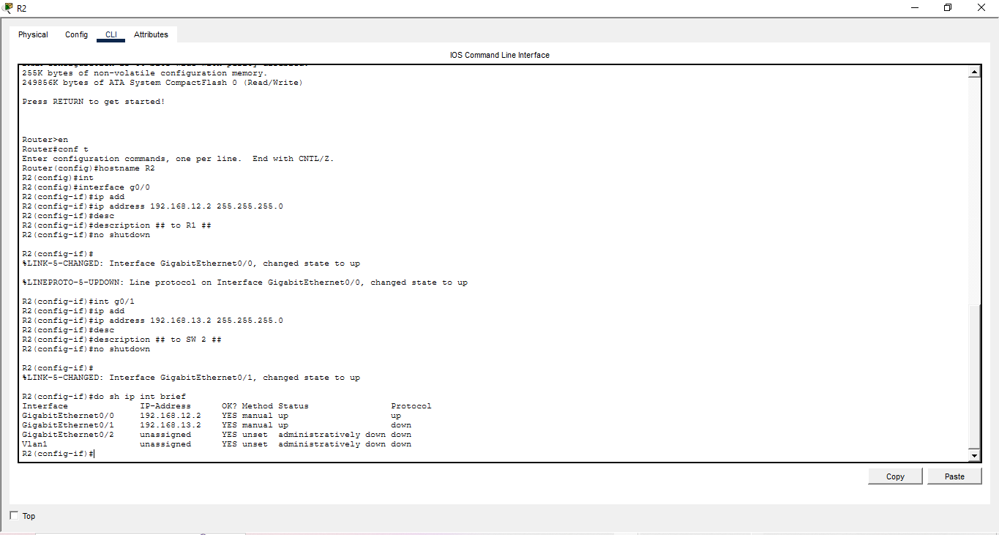
        192.168.12.2 -> int g0/0 -> to R1
        192.168.13.2 -> int g0/1 -> to R3
    - Thirdly, I configured R3 similar to R1 and R2 but different interfaces and IP addresses
        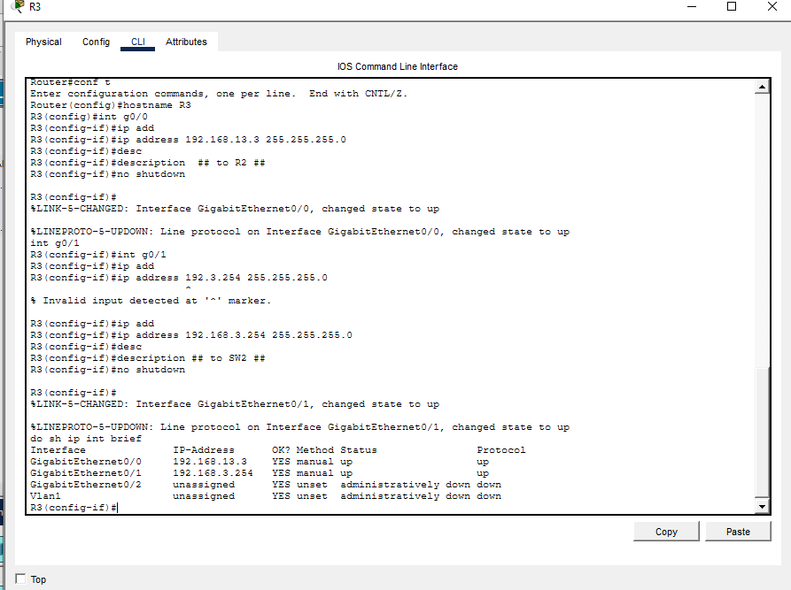
        192.168.12.3 -> int g0/0 -> to R2
        192.168.3.254 -> int g0/1 -> to SW2
    - Then, I configured PC2 like how I did with PC1
        - Config tab -> Default gateway: 192.168.3.254 (which is the R3's IP add.)
        - FastEthernet0 -> PC2 IP address: 192.168.3.1

2. Configure static routes on the routers to enable PC1 to successfully ping PC2.
    R1
    - 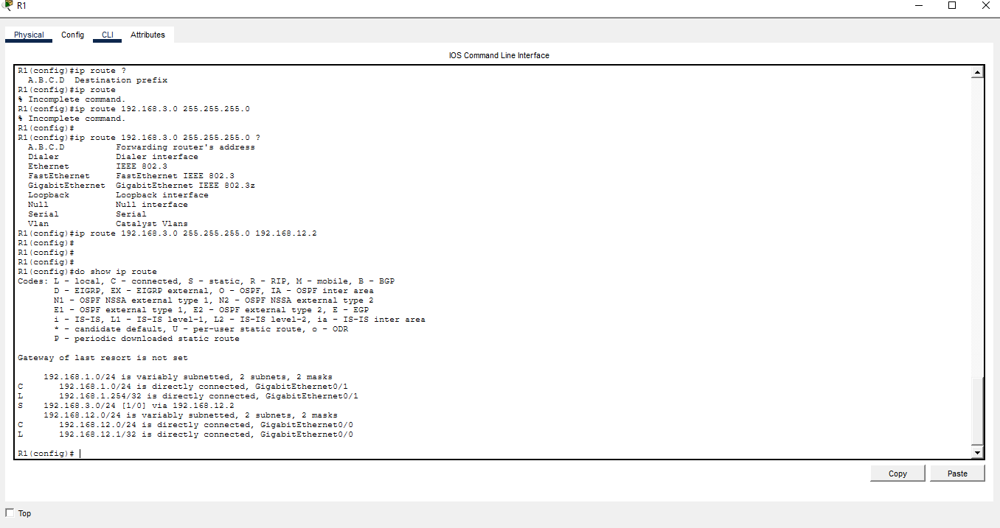

    R2
    - 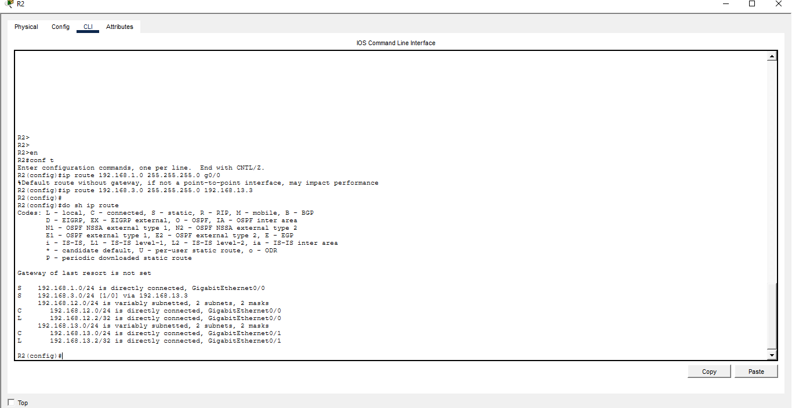
    - 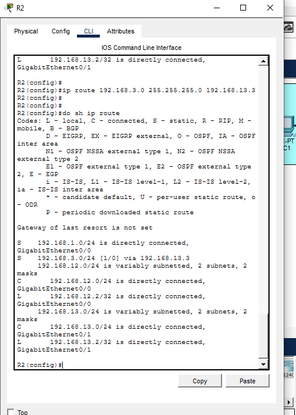

    R3
    - 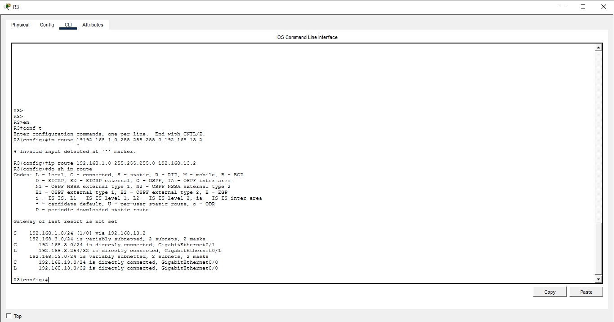

    Ping 
    - 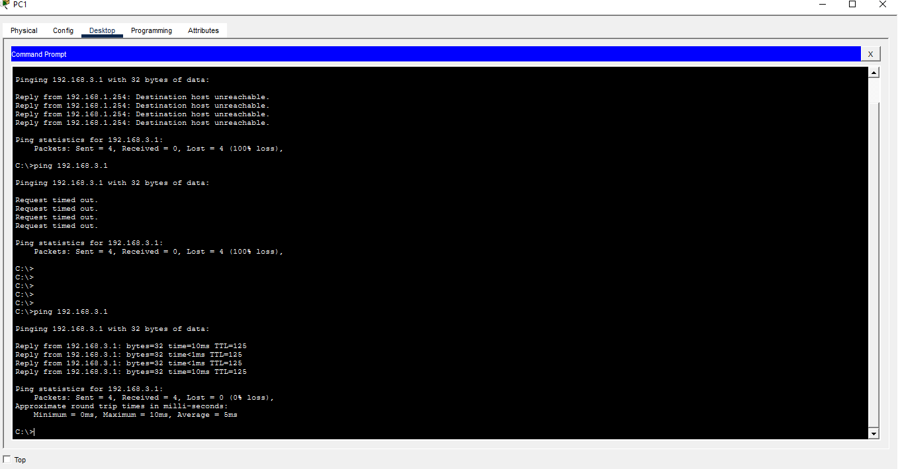
