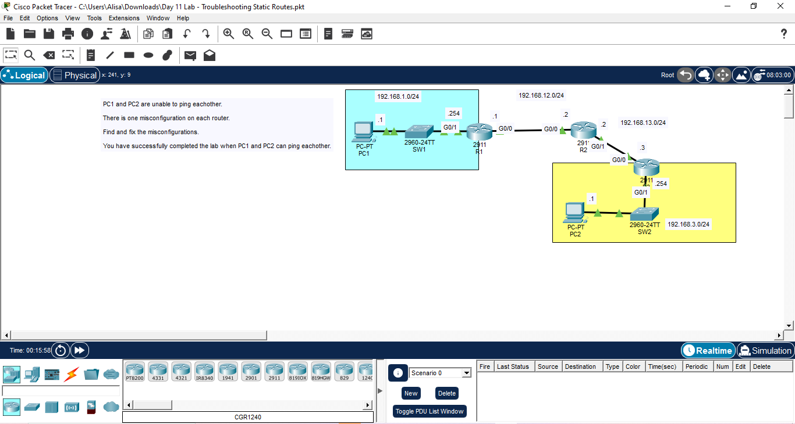
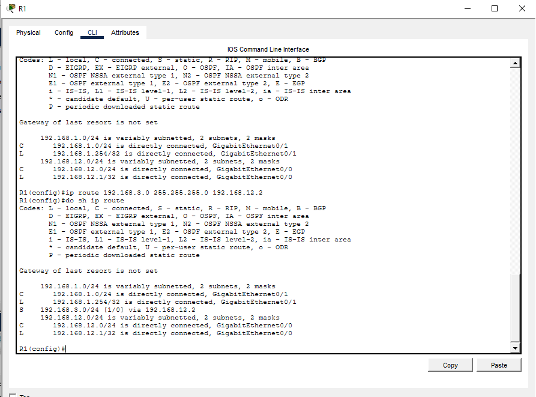
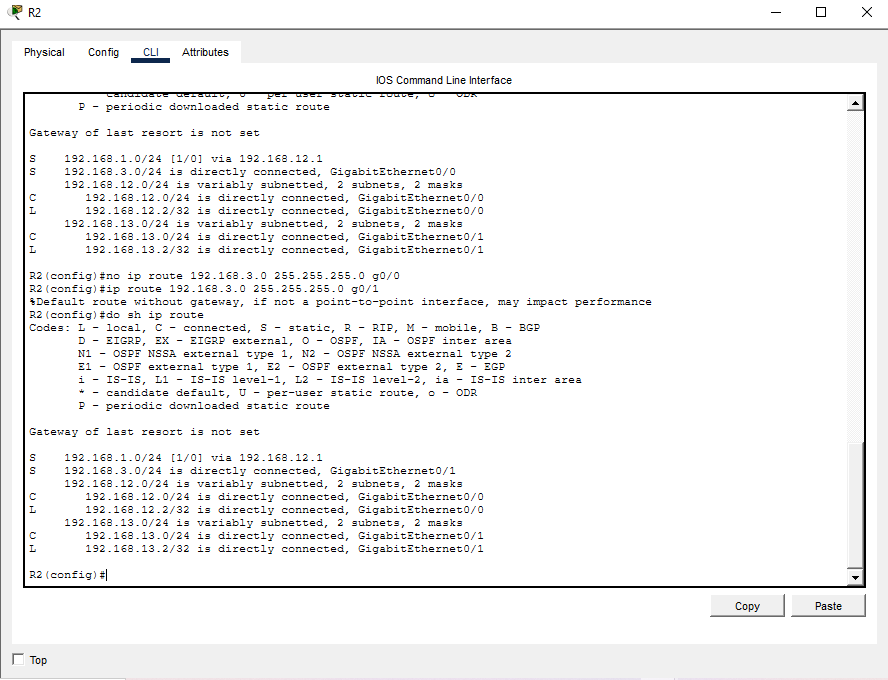
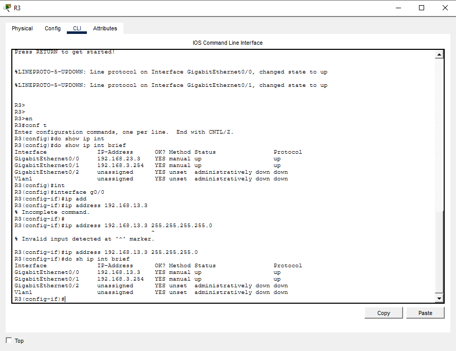
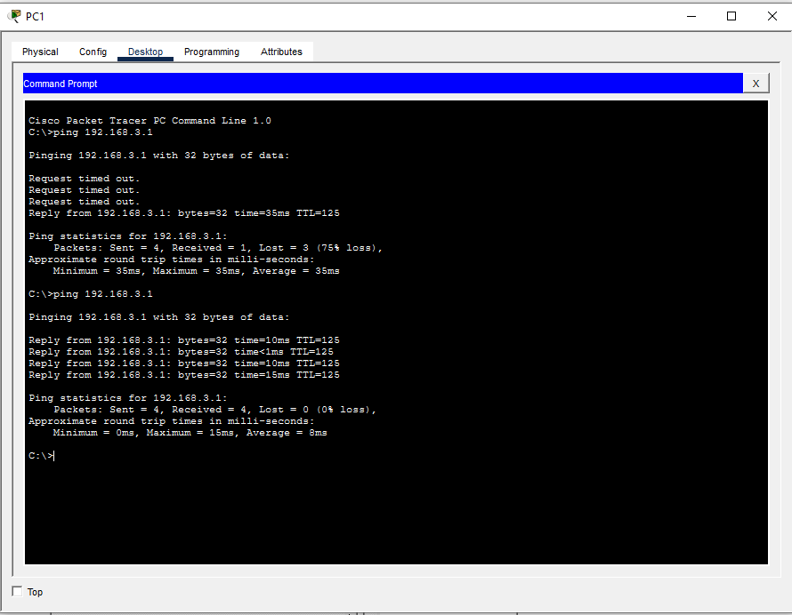

PC1 and PC2 are unable to ping eachother.

There is one misconfiguration on each router.

Find and fix the misconfigurations.

R1
- 
- Firstly, I checked whether the IP route is correct in R1.
- To reach PC2, the static route should be 192.168.12.2, which is R2 IP address and interface and not 192.168.12.3.
- I used command: 'no ip config 192.168.3.0 255.255.255.0 192.168.12.3' to delete the previous wrong IP route.
- Then I input the new and correct one: 'ip config 192.168.3.0 255.255.255.0 192.168.12.2'

R2
- 
- I checked the IP route: 'do show ip route'
- I found out that the interface doesn't match the IP address of static route connecting to 192.168.3.0/24 network which is g0/1 and not g0/0
- I deleted the interface on the route using command: 'no ip route 192.168.3.0 255.255.255.0 g0/0'
- I updated the new interface matching the 192.168.3.0/24 interface: 'ip route 192.168.3.0 255.255.255.0 g0/1'

R3
- 
- I checked the ip address table
- The interface of g0/0 has wrong ip, which should be 192.168.13.3 and not 192.168.23.3.
- I updated the interface: interface g0/0 -> ip address 192.168.13.3 255.255.255.0

PC1 ping PC2

- Lastly, I try ping PC2 from PC1 and it works.