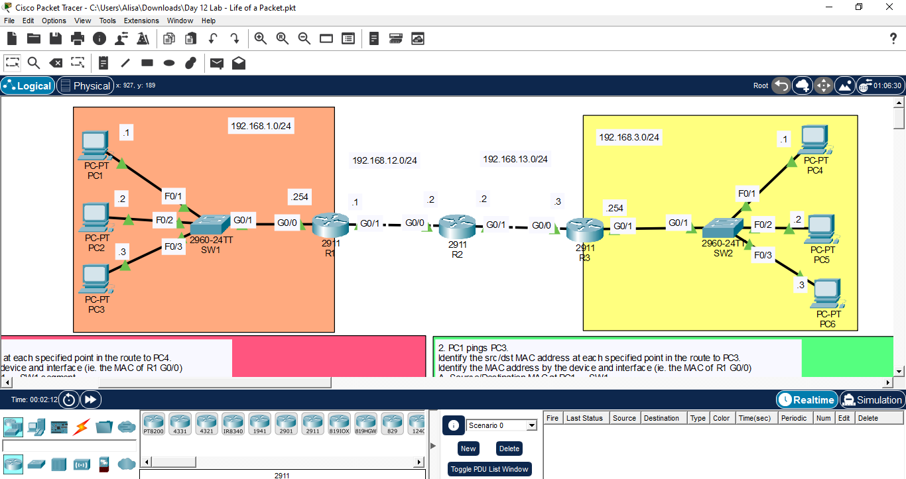

1. PC1 pings PC4.  
Identify the src/dst MAC address at each specified point in the route to PC4.
Identify the MAC address by the device and interface (ie. the MAC of R1 G0/0)

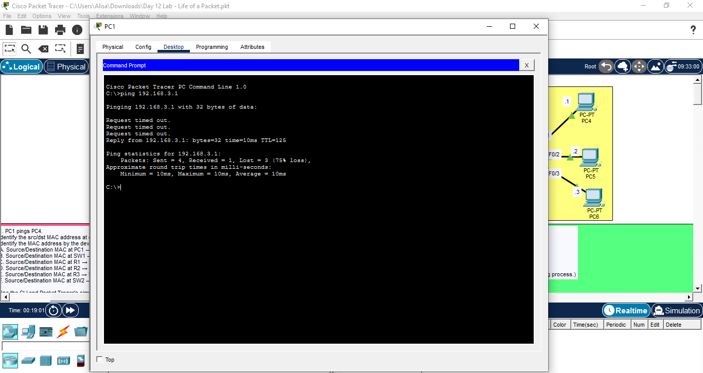
Ping to finish ARP

A. Source/Destination MAC at PC1 → SW1 segment
Command prompt for PC1 (ipconfig /all)
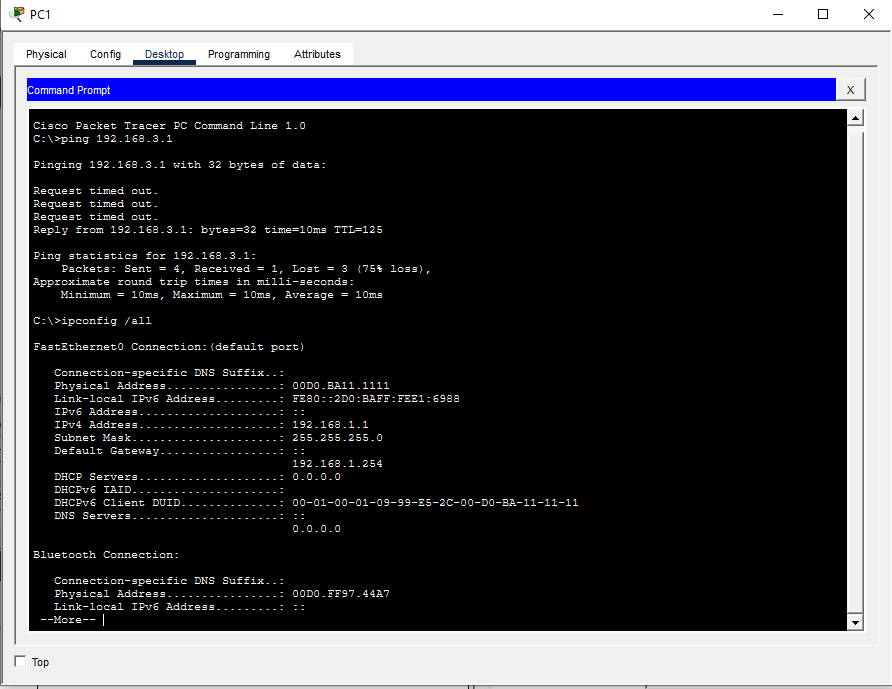

CLI on R1 (priv mode->show interfaces g0/0)
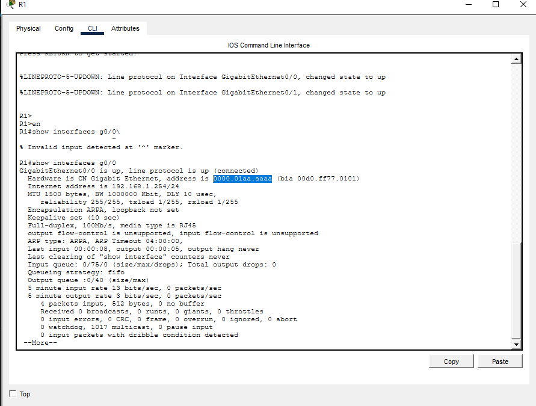

After Simulation mode
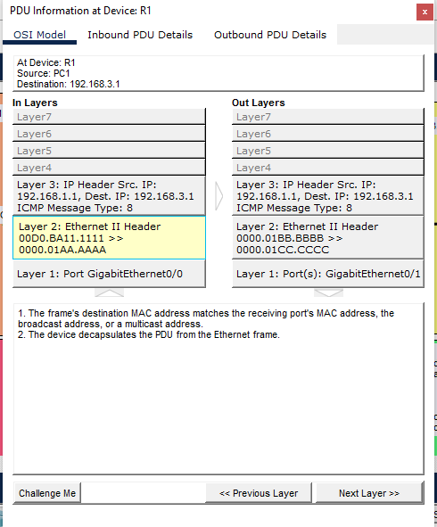

Answer: 00D0.BA11.1111 -> 0000.01aa.aaaa

B. Source/Destination MAC at SW1 → R1 segment
Command prompt for PC1 (ipconfig /all)

CLI on R1 (priv mode->show interfaces g0/0)

After Simulation mode

Answer: 00D0.BA11.1111 -> 0000.01aa.aaaa

C. Source/Destination MAC at R1 → R2 segment

CLI on R1 (priv mode -> show interfaces g0/1)
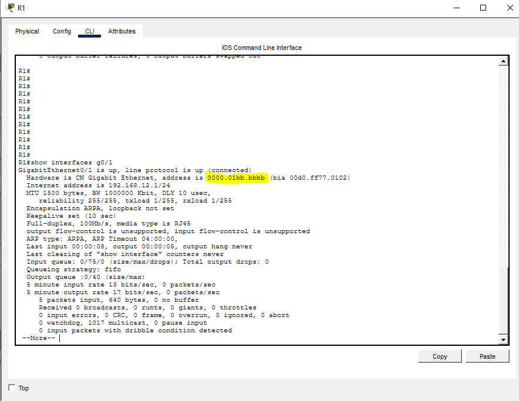

CLI on R2 (priv mode -> show interfaces g0/0)
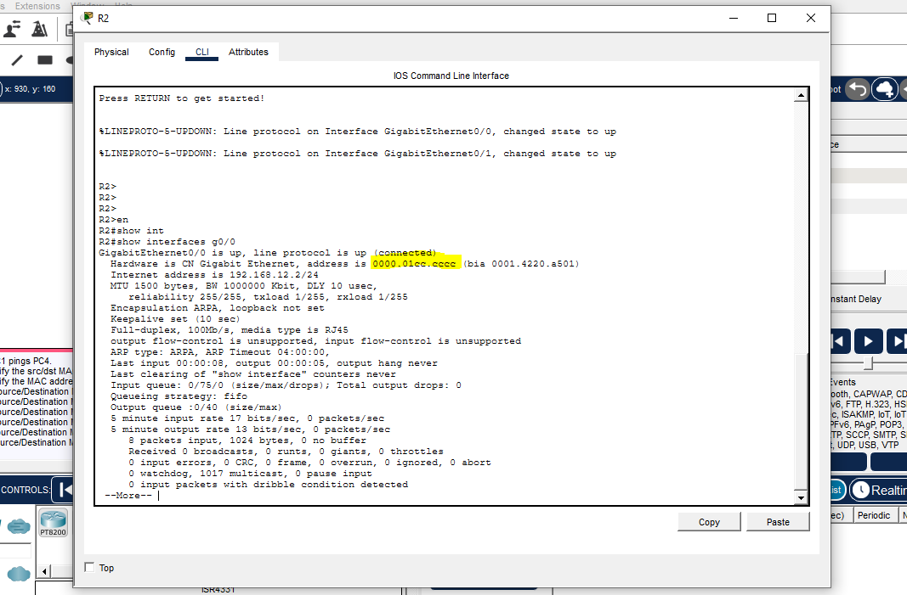

Simulation mode:
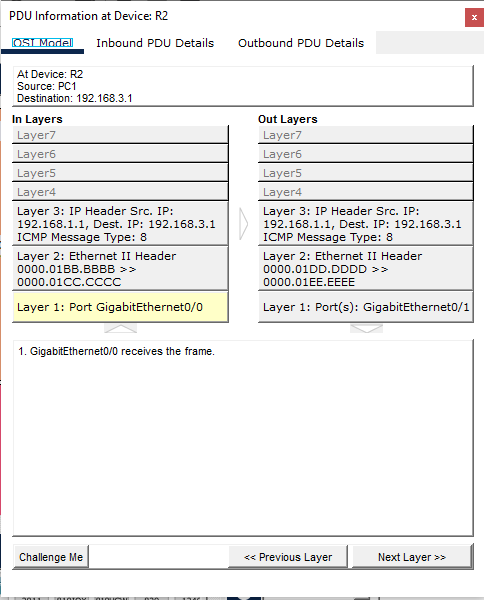
Answer: 0000.01bb.bbbb -> 0000.01cc.cccc

D. Source/Destination MAC at R2 → R3 segment

CLI on R2 (priv mode -> show interfaces g0/1)
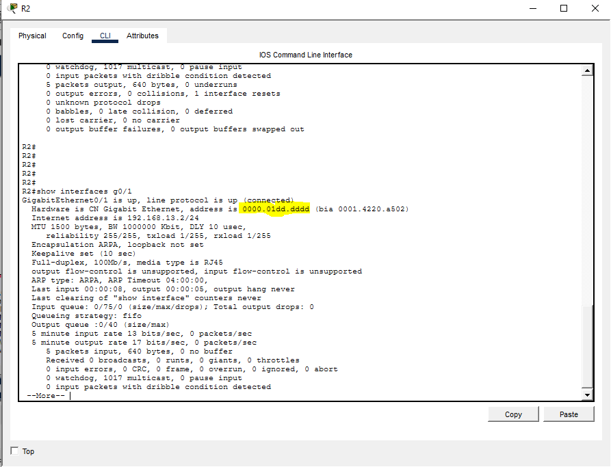

CLI on R3 (priv mode -> show interfaces g0/0)
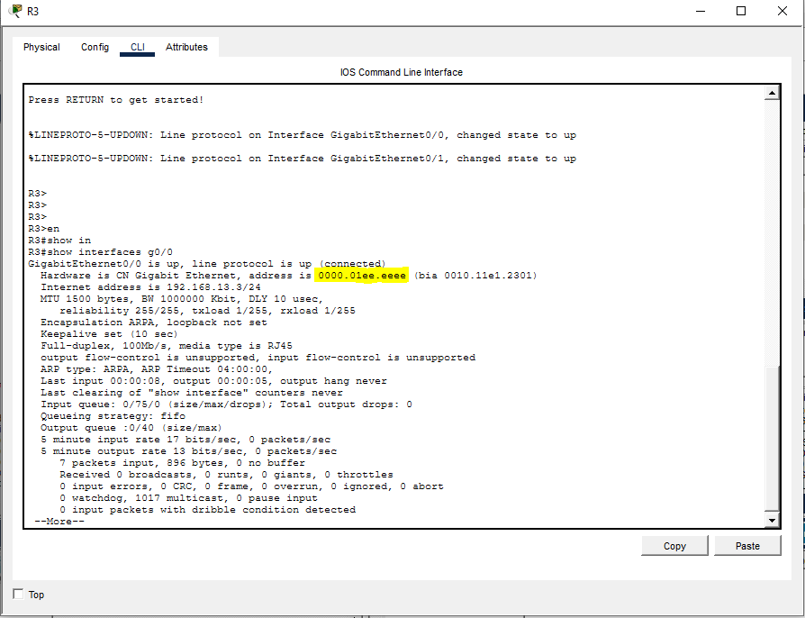

Simulation mode R2 to R3
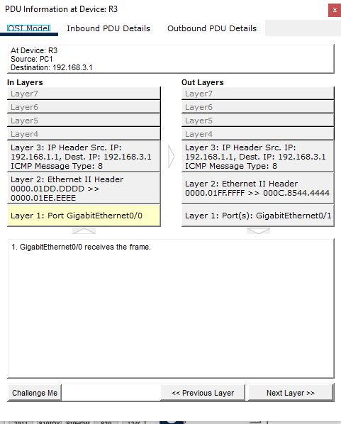
Answer: 0000.01dd.dddd -> 0000.01ee.eeee

E. Source/Destination MAC at R3 → SW2 segment

F. Source/Destination MAC at SW2 → PC4 segment

CLI on R3 (priv mode -> show interfaces g0/1)
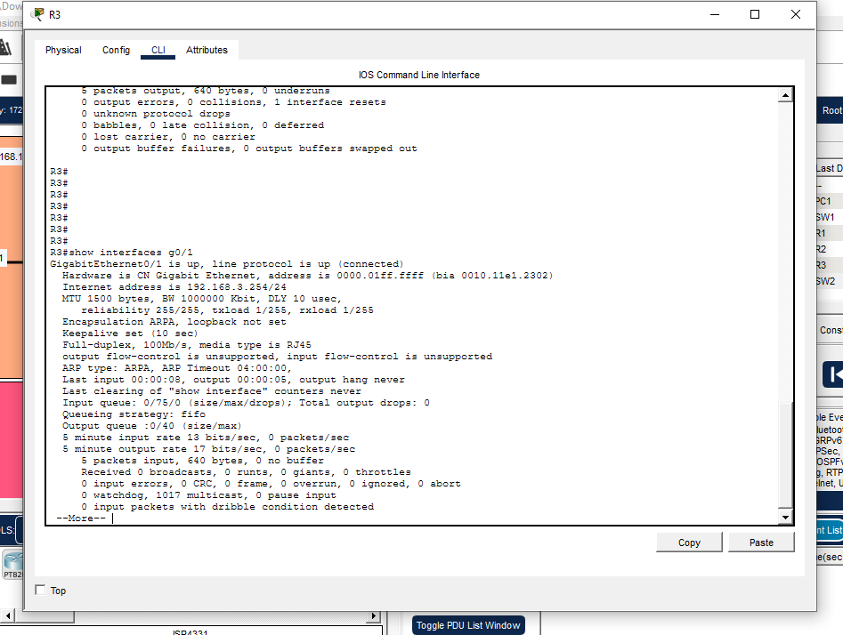

Command Prompt (ipconfig /all)
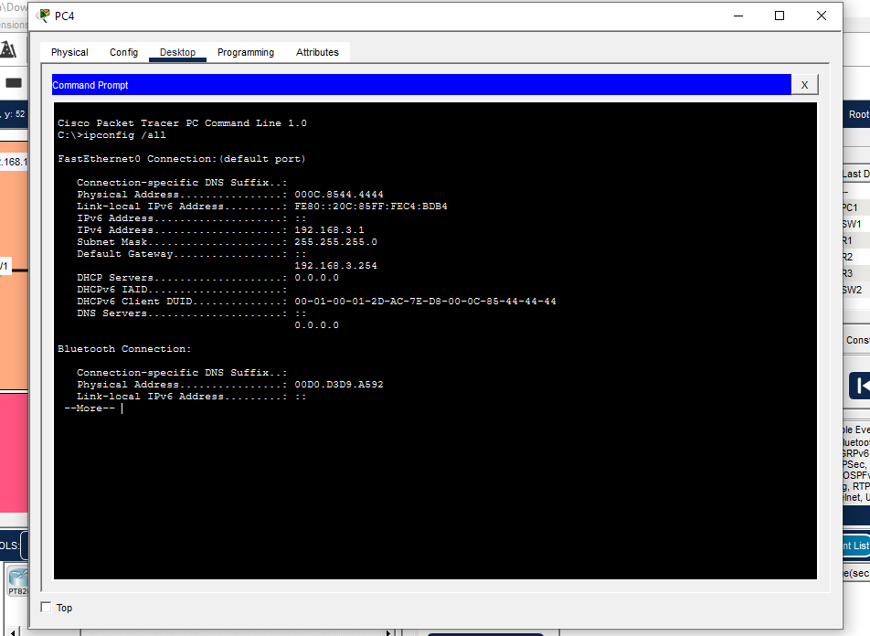

Simulation mode:
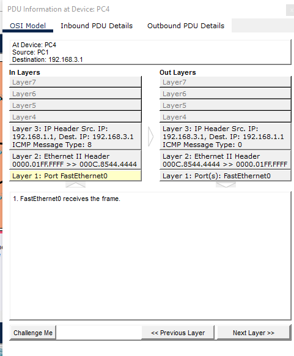
Answer: 0000.01ff.ffff -> 000C.8544.4444

Use the CLI and Packet Tracer's simulation mode to verify your answers.
(Before you enter simulation mode, ping once to complete ARP/the MAC learning process.)

2. PC1 pings PC3.
Identify the src/dst MAC address at each specified point in the route to PC3.
Identify the MAC address by the device and interface (ie. the MAC of R1 G0/0)

A. Source/Destination MAC at PC1 → SW1
B. Source/Destination MAC at SW1 → PC3

Simulation mode
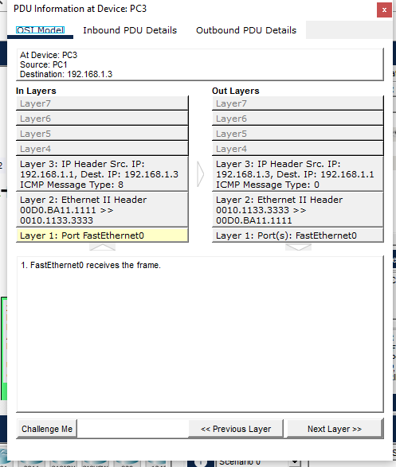
Answer for A and B: 00D0.BA11.1111 -> 0010.1133.3333

Use the CLI and Packet Tracer's simulation mode to verify your answers.
(Before you enter simulation mode, ping once to complete ARP/the MAC learning process.)

3. PC4 pings PC1.
Identify the src/dst MAC address at each specified point in the route to PC1.
Identify the MAC address by the device and interface (ie. the MAC of R1 G0/0).