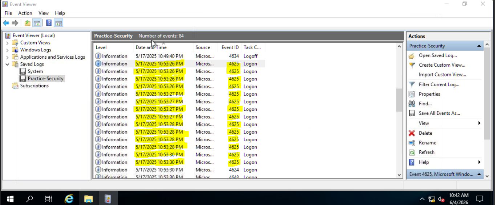
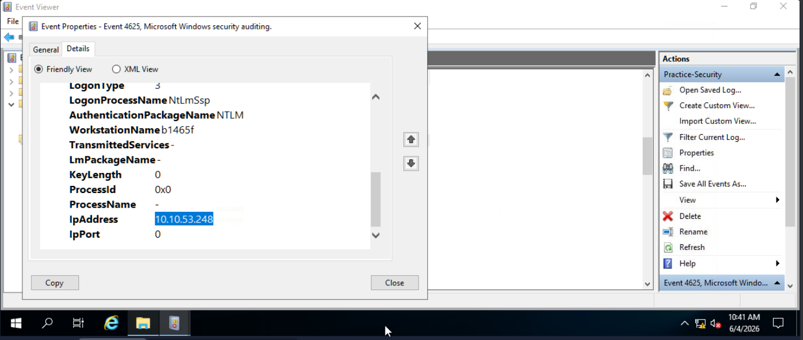
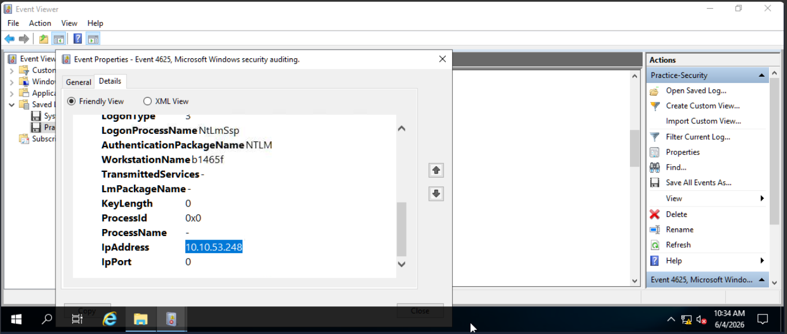
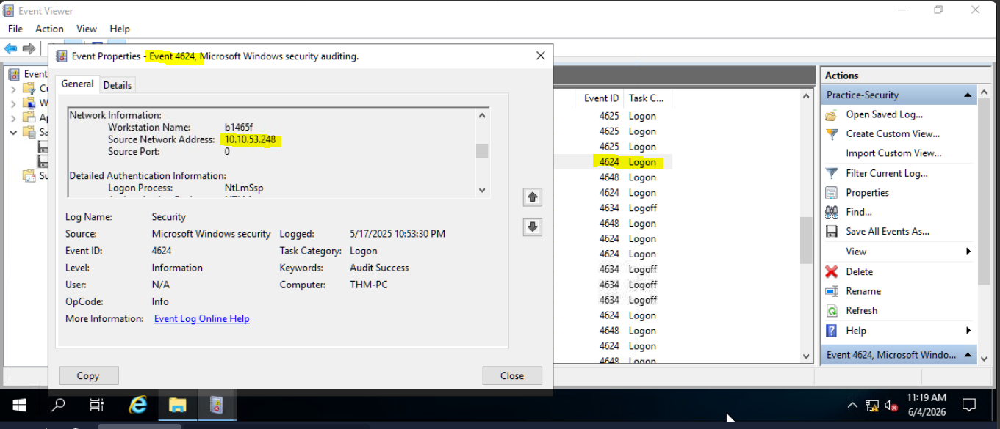

# Windows Event Log Analysis: Detect Suspicious Login Activity

## Incident Title: Suspicious Login Activity Detected

## Summary:
- At 17th May 2025, multiple login attempts from a same IP address were detected using Event Log on Windows. The first attempt started at 10:53:26PM and followed by failed attempts for 14 times. 

- 14 attempts

## Findings:

- The failed authentication attempts (Event ID 4625) originated from source IP address 10.10.53.248.

- Upon clicking the 'Details' tab of one of the 4625 event ID code on the last attempt (10:53:30PM) the IP address was  10.10.53.248.
- 14 failed login attempts since 10:53:26PM (Event ID 4625).
- 1 successful login (Event ID 4624) after the last 14th attempt on 10:53:30PM.

- Source IP: 10.10.53.248
- Time window: Short burst activity (in 4 seconds)

## Assessment:
- The short time interval between the failed authentication attempts (14 attempts within approximately 4 seconds), followed by a successful login from the same source IP address, is consistent with brute-force password guessing activity.

## Recommendation:
- Monitor future authentication attempts from the source IP.
- Review the affected account for suspicious activity.
- Enable account lockout policies to mitigate brute-force attacks.
- Verify whether the successful login was authorized.
- Consider implementing multi-factor authentication (MFA).